<a name="HOLTitle"></a>
# Azure Web Apps #

---

<a name="Overview"></a>
## Overview ##

[Azure App Service](https://azure.microsoft.com/en-us/documentation/articles/app-service-value-prop-what-is/) is a set of services provided by Microsoft Azure to enable developers to easily build and deploy Web apps and mobile apps for various platforms and devices. Included in the App Service family are [Azure Web Apps](https://azure.microsoft.com/en-us/documentation/articles/app-service-web-overview/), which allow you to quickly and easily deploy Web sites built with tools and languages you’re already familiar with; [Azure Mobile Apps](https://azure.microsoft.com/en-us/documentation/articles/app-service-mobile-value-prop/), which provide data services, syncing services, notification services, and other back-end services for popular mobile operating systems; [Azure API Apps](https://azure.microsoft.com/en-us/documentation/articles/app-service-api-apps-why-best-platform/), which simplify the writing, publishing, and consuming of cloud APIs; and [Azure Logic Apps](https://azure.microsoft.com/en-us/documentation/articles/app-service-logic-what-are-logic-apps/), which are great for automating business processes.

Azure Web Apps makes deploying Web sites extraordinarily easy – and not just Web sites built using the Microsoft stack. You can deploy PHP apps that use MySQL just as easily as ASP.NET apps that use SQL Server. You can select from a wide variety of Web App templates or build templates of your own. You can configure Web Apps to auto-scale as traffic increases to ensure that your customers aren’t left waiting during periods of peak demand. You can publish apps to pre-production staging locations and test them in the cloud before taking them live, and then swap the staging deployments for the production deployments with the click of a button. You can even create WebJobs – programs or scripts that run continuously or on a schedule to handle billing and other time-critical tasks. In short, Azure Web Apps takes the pain out of publishing and maintaining Web apps and are just as suitable for a personal photo-sharing site as they are for enterprise-grade sites serving millions of customers.

In this lab, you will use the cross-platform [Visual Studio Code](https://code.visualstudio.com/) code editor to build a Web site that uses [PHP](http://php.net/) server-side scripting. The site will allow you to upload, browse, and display photos, and it will store photos in a [MySQL](http://www.mysql.com/) database. You will then provision a new Azure Web App to host the site. Finally, you will upload the site's content to the newly provisioned Web App and view it in your browser.

<a name="Objectives"></a>
### Objectives ###

In this hands-on lab, you will learn how to:

- Use Visual Studio Code to build a PHP and MySQL Web site
- Provision an Azure Web App to host the Web site
- Deploy the Web site using FTP

<a name="Prerequisites"></a>
### Prerequisites ###

The following are required to complete this hands-on lab:

- [Visual Studio Code](https://code.visualstudio.com/download)
- [PHP for Windows](http://windows.php.net/download/) <---THIS IS NOT REQUIRED

---
<a name="Exercises"></a>
## Exercises ##

This hands-on lab includes the following exercises:

- [Exercise 1: Build a Web site with Visual Studio Code](#Exercise1)
- [Exercise 2: Provision a MySQL Web App](#Exercise2)
- [Exercise 3: Deploy the Web site](#Exercise3)

Estimated time to complete this lab: **45** minutes.

<a name="Exercise1"></a>
## Exercise 1: Build a Web site with Visual Studio Code

In this exercise, you will use [Visual Studio Code](https://code.visualstudio.com/) to build a Web site. Visual Studio Code is a free, cross-platform code editor available for Windows, OS X, and Linux that supports a variety of programming languages, both natively and via extensions. It also features built-in Git support as well as syntax highlighting and code completion via [IntelliSense](https://code.visualstudio.com/#meet-intellisense).

1. Start Visual Studio Code.  Open the **File** menu and select **Open Folder**.

    <!-- 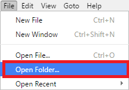

    _Starting the project_ -->

1. In the Select Folder dialog, choose a suitable folder for your Web site's code. Then click the **Select Folder** button.

    <!-- 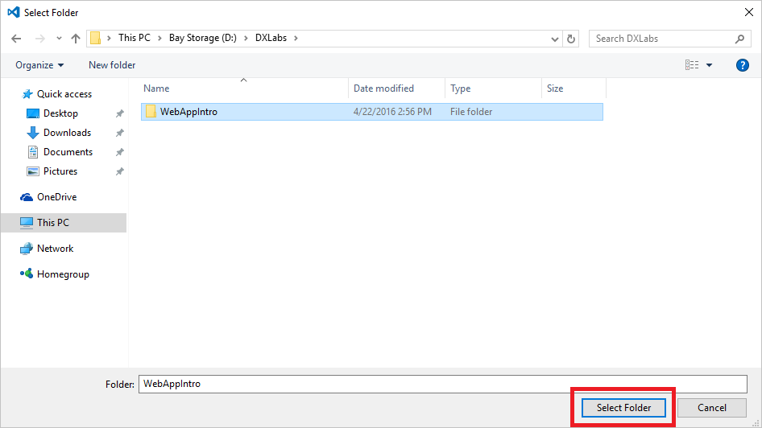

    _Selecting a project folder_ -->

1. From the **File** menu, select **New File**.

    <!-- 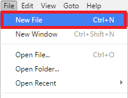

    _Adding a file to the project_ -->

1. Add the following code and markup to the new file to serve as the main page for your Web site:

    ```html
    <!DOCTYPE html>
    <html>
    <head>
        <title>My Images</title>
        <!-- Latest compiled and minified CSS -->
        <link rel="stylesheet" href="https://maxcdn.bootstrapcdn.com/bootstrap/3.3.6/css/bootstrap.min.css"
            integrity="sha384-1q8mTJOASx8j1Au+a5WDVnPi2lkFfwwEAa8hDDdjZlpLegxhjVME1fgjWPGmkzs7"
            crossorigin="anonymous">
        <!-- Optional theme -->
        <link rel="stylesheet" href="https://maxcdn.bootstrapcdn.com/bootstrap/3.3.6/css/bootstrap-theme.min.css"
            integrity="sha384-fLW2N01lMqjakBkx3l/M9EahuwpSfeNvV63J5ezn3uZzapT0u7EYsXMjQV+0En5r"
            crossorigin="anonymous">
        <link rel="stylesheet" href="content/styles.css" type='text/css'>

        <!-- jQuery (necessary for Bootstrap's JavaScript plugins) -->
        <script src="https://ajax.googleapis.com/ajax/libs/jquery/1.11.3/jquery.min.js"></script>
        <!-- Latest compiled and minified JavaScript -->
        <script src="https://maxcdn.bootstrapcdn.com/bootstrap/3.3.6/js/bootstrap.min.js"
            integrity="sha384-0mSbJDEHialfmuBBQP6A4Qrprq5OVfW37PRR3j5ELqxss1yVqOtnepnHVP9aJ7xS"
            crossorigin="anonymous"></script>

    </head>
    <body>
        <div class="container-fluid bg-primary">
            <div class="row col-md-12">
                <h3>My Images</h3>
            </div>
        </div>

        <div class="navbar navbar-default">
            <form class="navbar-form navbar-left" enctype="multipart/form-data" action="<?php echo $_SERVER['PHP_SELF']; ?>" method="post">
                <div class="form-group">
                    <label class="sr-only" for="imageToUpload">Image to Upload</label>
                    <div class="input-group">
                        <span class="input-group-btn">
                            <span class="btn btn-default btn-file" type="button">
                                Image File:<input type="file" id="imageToUpload" name="imageToUpload">
                            </span>
                        </span>
                        <input type="text" class="form-control" placeholder="Select a file to upload..." id="selectedFileName" readonly>
                    </div>
                </div>
                <button type="submit" class="btn btn-default navbar-btn">Upload</button>
                <?php
                    if (isset($_FILES['imageToUpload'])) {
                        include "images.php";
                        try {
                            $msg = Images::Upload();  // this will upload the image
                            echo "<p class='navbar-text navbar-right'>".$msg."</p>";  // Message showing success or failure.
                            }
                        catch (Exception $e) {
                            echo "<p class='navbar-text navbar-right text-danger'>"."Sorry, could not upload file".$e->getMessage()."</p>";
                        }
                    }
                ?>
            </form>
        </div>

        <div class="container-fluid">
            <div class="row">
                <?php
                    include "images.php";
                    $images = Images::GetImages();
                    foreach ($images as $image) {
                ?>
                    <div class='col-lg-2 col-md-4 col-sm-6 col-xs-12'>
                        <?php
                            echo "<a href='image_display.php?id=".$image->id."' target='_blank'>";
                            echo "id."&width=192' alt='' />";
                            echo "</a>";
                        ?>
                    </div>
                <?php
                    }
                ?>
            </div>
        </div>

        <script type="text/javascript" language="javascript">
            // Show name of selected image file in the text display in the custom UI element
            $(document).ready(function () {
                $(document).on('change', '.btn-file :file', function () {
                    var input = $(this),
                        numFiles = input.get(0).files ? input.get(0).files.length : 1,
                        label = input.val().replace(/\\/g, '/').replace(/.*\//, '');
                    input.trigger('fileselect', [numFiles, label]);
                })

                $('.btn-file :file').on('fileselect', function (event, numFiles, label) {
                    console.log(numFiles);
                    console.log(label);
                    $("#selectedFileName").val(label);
                });
            });
        </script>
    </body>
    </html>
    ```

1. Use the **File -> Save** command to save the file. Name it **index.php**.

    <!-- 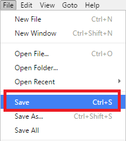

    _Saving the file_ -->

    Thanks to the .php file-name extension, Visual Studio Code knows that this is a PHP file and applies the appropriate syntax highlighting:  

    <!-- 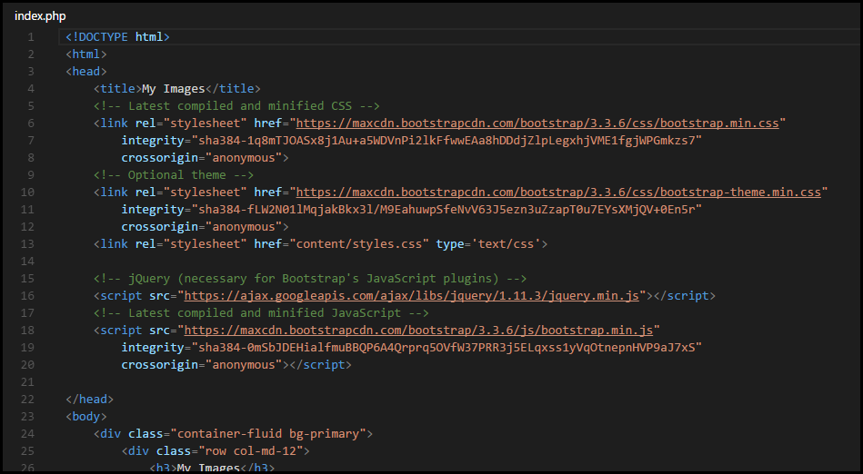

    _Syntax highlighting in Visual Studio Code_ -->

1. Repeat Steps 3 and 4 to add a file named **image_display.php** containing the following code to the project. This is the code that returns images requested by the browser over HTTP.

    ```php
    <?php
        if ((isset($_GET['id']) && is_numeric($_GET['id'])) === FALSE) die;

        include "images.php";
        $imageId = $_GET['id'];
        $image = Images::GetImage($imageId);

        // Get the source image attributes
        $srcImage = $image->image;
        $srcSize = getImageSizeFromString($srcImage);
        $srcWidth = $srcSize[0];
        $srcHeight = $srcSize[1];
        $srcType = $srcSize[2];
        $srcMime = $srcSize['mime'];
        $srcImageResource = imageCreateFromString($srcImage);

        // set the header for the image
        header("Content-type: ".$srcMime);

        if ((isset($_GET['width']) && is_numeric($_GET['width'])) === FALSE) {
            // No width requested - just return the source
            echo $srcImage;
            exit;
        }

        // Resize/resample the image to the requested size
        $destWidth = $_GET['width'];
        $destHeight = $destWidth * $srcSize[1] / $srcSize[0];
        $destWidth = $srcWidth;
        $destHeight = $srcHeight;

        // // echo "width = ".$destWidth." height = ".$destHeight;
        $destImageResource = imageCreateTrueColor($destWidth, $destHeight);
        imagealphablending($destImageResource, false);
        imagesavealpha($destImageResource, true);
        imageCopyResampled($destImageResource, $srcImageResource, 0,0,0,0, $destWidth, $destHeight, $srcWidth, $srcHeight);

        // export the image
        switch ($srcType) {
            case IMAGETYPE_JPEG:
                imageJPEG($destImageResource);
                break;
            case IMAGETYPE_PNG:
                imagePNG($destImageResource);
                break;
            default:
                imageJPEG($destImageResource);
                break;
        }

        imageDestroy($destImageResource);
    ?>
    ```

1. Repeat Steps 3 and 4 to add a file named **images.php** containing the following code to the project. This is the code used to upload, store, and retrieve images.

    ```php
    <?php
        include "database.php";

        class Images {

            public static function Upload() {

                $maxsize = 10000000; // set to approx 10 MB

                // check associated error code
                if ($_FILES['imageToUpload']['error'] == UPLOAD_ERR_OK) {

                    // check whether file is uploaded with HTTP POST
                    if (is_uploaded_file($_FILES['imageToUpload']['tmp_name'])) {    

                        //checks size of uploaded image on server side
                        if ( $_FILES['imageToUpload']['size'] < $maxsize) {  

                            // checks whether uploaded file is of image type
                            $finfo = finfo_open(FILEINFO_MIME_TYPE);
                            if (strpos(finfo_file($finfo, $_FILES['imageToUpload']['tmp_name']), "image") === 0) {    

                                // open the image file for insertion
                                $imagefp = fopen($_FILES['imageToUpload']['tmp_name'], 'rb');

                                // put the image in the db...
                                $database = new Database();
                                $id = $database->UploadImage($_FILES['imageToUpload']['name'], $imagefp);
                                $msg = 'Image successfully saved in database with id = ' . $id;
                            }
                            else {
                                $msg = "Uploaded file is not an image.";
                            }
                        }
                        else {
                            // if the file is not less than the maximum allowed, print an error
                            $msg = '<div>File exceeds the Maximum File limit</div>
                                <div>Maximum File limit is '.$maxsize.' bytes</div>
                                <div>File '.$_FILES['imageToUpload']['name'].' is '.$_FILES['imageToUpload']['size'].
                                ' bytes</div><hr />';
                        }
                    }
                    else
                        $msg = "File not uploaded successfully.";

                }
                else {
                    $msg = file_upload_error_message($_FILES['imageToUpload']['error']);
                }
                return $msg;
            }

            public static function GetImages() {
                $database = new Database();
                $images = $database->GetAllImages();
                return $images;
            }

            public static function GetImage($id) {
                $database = new Database();
                $image = $database->FindImage($id);
                return $image;
            }
        }
    ?>  
    ```

1. Repeat Steps 3 and 4 to add a file named **database.php** containing the following code to the project. This is the code used to interact with the MySQL database. Observe that the database connection string isn't embedded in the code, but is instead retrieved from an environment variable named *MYSQLCONNSTR_localdb*.

    ```php
    <?php
        class Database {

            private $link;

            public function __construct() {
                // Notice that private connection information is *NOT* part of the source
                // and therefore does not end up in public repos, etc.
                $connectionString = getenv("MYSQLCONNSTR_localdb");
                $varsString = str_replace(";","&", $connectionString);
                parse_str($varsString);

                $host = $Data_Source;
                $user = $User_Id;
                $pass = $Password;
                $db = $Database;

                try{
                    $this->link = new PDO("mysql:host=".$host.";dbname=".$db, $user, $pass);
                    $this->link->setAttribute(PDO::ATTR_ERRMODE, PDO::ERRMODE_EXCEPTION);

                }
                catch (PDOException $e){
                    echo "Error: Unable to connect to MySQL: ". $e->getMessage();
                    die;
                }

                $this->InitializeImageTable();
            }   

            public function __destruct() {
                $this->link = null;
            }

            public function UploadImage($imageName, $imageFP) {
                $sql = $this->link->prepare("INSERT INTO images (name, image) VALUES (:name, :image);");
                $sql->bindParam(":name", $imageName);
                $sql->bindParam(":image", $imageFP, PDO::PARAM_LOB);

                $sql->execute();

                return $this->link->lastInsertId();
            }

            public function GetAllImages() {
                $sql = $this->link->prepare("SELECT * FROM images;");
                $sql->execute();

                $results = $sql->fetchAll(PDO::FETCH_OBJ);

                return $results;
            }

            public function FindImage($id) {
                $sql = $this->link->prepare("SELECT * FROM images WHERE id = :id;");
                $sql->bindParam(":id", $id, PDO::PARAM_INT);
                $sql->execute();

                $result = $sql->fetch(PDO::FETCH_OBJ);
                return $result;
            }

            private function InitializeImageTable() {
                // Check to see if the table needs to be created
                $results = $this->link->query("SHOW TABLES LIKE 'images';");
                if ($results == TRUE && $results->rowCount() > 0) {
                    return;
                }

                // create table
                $sql = "CREATE TABLE images (
                    id INT(10) NOT NULL AUTO_INCREMENT PRIMARY KEY,
                    name VARCHAR(255) NOT NULL DEFAULT '',
                    image LONGBLOB NOT NULL
                    );";

                if ($this->link->query($sql) != TRUE) {
                    die("Error creating image table: " . $this->link->error);
                }
            }
        }
    ?>
    ```

1. Open the **View** menu and select **Explore**. In the panel that appears, hover the mouse over the project folder and click the **New Folder** icon to create a new folder in the project folder. Name the new folder **Content**.

    <!-- 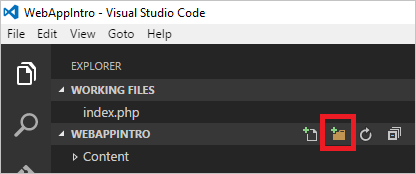

    _Adding a Content folder to the project_ -->

1. Repeat Steps 3 and 4 to add a file named **styles.css** containing the following CSS to the **Content** folder that you just created:

    ```css
    /* Custom background color for the nav-bar element. */
    .navbar {
        background-color: #d9edf7;    /*matches bg-info*/
        background-image: none;
        background-repeat: no-repeat;
        filter: none;
    }

    /* Support for custom-looking File Selection button. */
    .btn-file {
        position: relative;
        overflow: hidden;
    }
    .btn-file input[type=file] {
        position: absolute;
        top: 0;
        right: 0;
        min-width: 100%;
        min-height: 100%;
        font-size: 100px;
        text-align: right;
        filter: alpha(opacity=0);
        opacity: 0;
        outline: none;
        background: white;
        cursor: inherit;
        display: block;
    }

    /* Styling/framing for the image elements. */
    img {
        width: 192px;
        background-color: white;
        padding: 5px 5px 30px 5px;
        -webkit-transform: rotate(10deg);
        -moz-transform: rotate(10deg);
        -o-transform: rotate(10deg);
        -ms-transform: rotate(10deg);
    }

    img:hover {
        -webkit-transform: rotate(0deg);
        -moz-transform: rotate(0deg);
        -o-transform: rotate(0deg);
        -ms-transform: rotate(0deg);
    }

    /* Custom queries for force line breaks depending on the resolution. */
    @media (min-width: 1200px) {
    .col-lg-2:nth-child(6n+1) {
            clear: both;
        }
    }

    @media (min-width: 992pxpx) and (max-width: 1200px) {
        .col-md-4:nth-child(3n+1) {
            clear: both;
        }
    }

    @media (min-width: 768px) and (max-width: 992px) {
        .col-sm-6:nth-child(2n+1) {
            clear: both;
        }
    }
    ```

The files listed in the Explorer panel for your project should now look like this:

<!-- 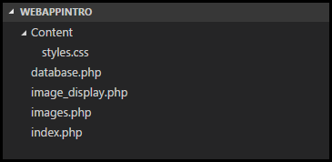

_Project content_ -->

That's it! Your photo-sharing Web site is built. The next step is to provision an Azure Web App to host it.

<a name="Exercise2"></a>
## Exercise 2: Provision a MySQL Web App

There are several ways to provision an Azure Web App. In this exercise, you will use the Azure Portal to do it. Provisioning is quick and easy and involves little more than answering a few questions and clicking a few buttons. Once the Web App is provisioned, you can navigate to it in your browser just as you would any other Web site.

1. Open the [Azure Portal](https://portal.azure.com) in your browser. If you are asked to log in, do so using your Microsoft account.

1. Click **+ New**. In the "New" blade that opens, type the words "web app" This is same app type as we have deployed before (without quotation marks) into the search box and press **Enter**.

    <!-- 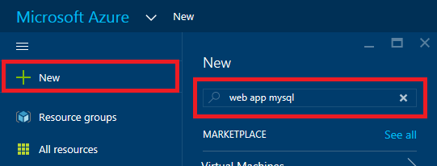

    _Finding the "Web App + MySQL" template_ -->

1. Two new blades named "Marketplace" and "Everything" will open in the portal. The former represents the [Microsoft Azure Marketplace](https://azure.microsoft.com/en-us/marketplace/), which is an online store containing thousands of free templates for deploying apps, services, virtual machines, and more, preconfigured for Azure and provisioned with popular tools such as WordPress, CakePHP, and Django. In the "Everything" blade, click **Web App**.

    <!-- 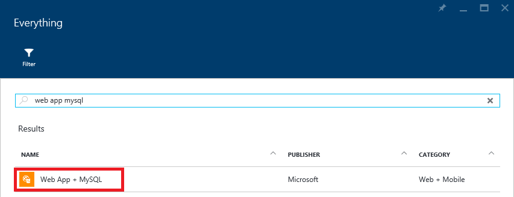

    _Selecting the "Web App + MySQL" template_ -->

1. In the "Web App" blade that opens, take a moment to review the text and learn what the template provisions. Then click the **Create** button at the bottom of the blade.

    <!-- 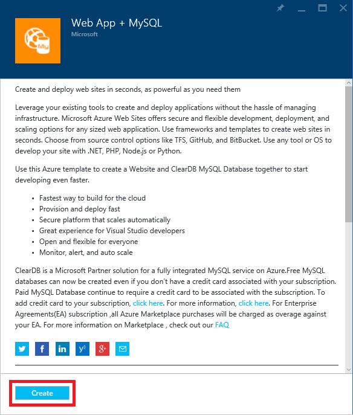

    _Creating a Web App with MySQL_ -->

1. Complete the form displayed in the "Web App + MySQL" blade.

    - In the **App name** field, enter a name for your Web App. This name, along with the domain _.azurewebsites.net_, becomes the URL for your Web site, so it must be unique.

	- In the **Subscription** field, select the subscription (for example, **Azure Pass**) that you wish to charge to.

    - Make sure **Create new** is selected under **Resource Group**, and type "<user_name>dxwebappintro" (without quotation marks) into the box below to name the new resource group.

		> Resource groups are a relatively recent addition to Azure and are a powerful construct for grouping resources such as storage accounts, databases, and virtual machines together so they can be managed as a unit. Imagine that you created a complex application consisting of multiple storage accounts, a cluster of VMs, a SQL database, and perhaps a Stream Analytics solution and a pair of event hubs. Now you want to create a new instance of the application using a different account. By assembling all these resources into a resource group, you can take advantage of [Azure deployment templates](https://azure.microsoft.com/en-us/documentation/articles/arm-template-deployment/) to script the creation of the entire application. In addition, you can use role-based security to restrict access to resources in a resource group, and you can delete the application — and all of the resources that comprise it — by deleting the resource group. You will learn more about resource groups and deployment templates in subsequent labs.

    - Click **App Service plan/Location**, and then click the **Create New** button in the blade that appears. An App Service plan determines the location and size of the virtual machine(s) that host your Web App. Multiple Azure App Service resources can share the same App Service so you can maximize your resource usage.

        - Name the App Service plan "<user_id>dxwebappintro" (without quotation marks).

        - Set **Location** to the location assigned to you.

        - Click **Pricing tier** to see a list of available pricing options. The list that is shown will initially be limited to a handful of recommended options. Click **View all** to see all pricing options.

	        <!-- 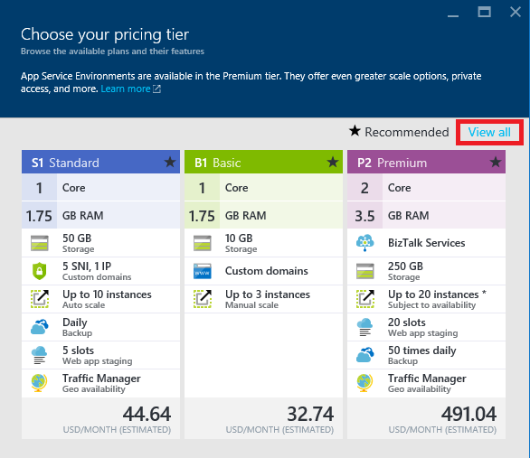

	        _Viewing all pricing tiers_ -->

			> Take a moment to review the different options. The tiers are differentiated by several factors, including the number of CPU cores, amount of RAM, amount of available storage, and frequency of backups. Each block also includes the estimated monthly charge for each tier.

        - Scroll to the bottom of the blade, select the **F1 Free** block, and click the **Select** button. Then click **OK** at the bottom of the "App Service plan" blade.

	        <!-- 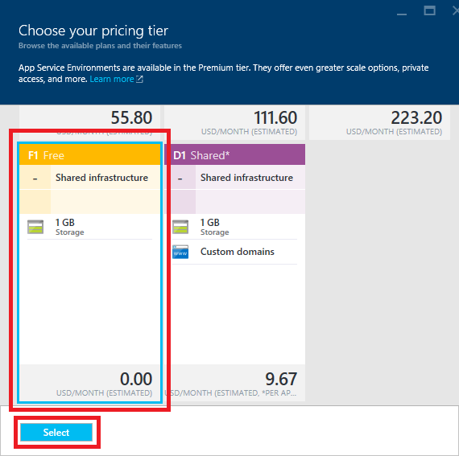

	        _Selecting the F1 pricing tier_ -->

    - Select **Database Provide** and choose "MySQL in App" .

    - Click the **Create** button to begin provisioning your Web App and database.

    <!-- 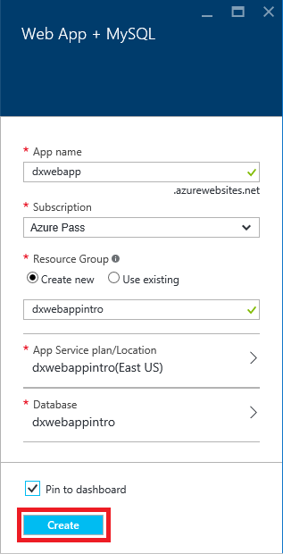

    _Completed "Web App + MySQL" blade_ -->

1. Once the Web App and database have been provisioned, the Azure Portal automatically opens a blade for the Web App, along with a "Settings" blade. Take a moment to examine these blades' content.

    > If your Web site's blade is not automatically opened in the Azure Portal, click the tile that was created for it on the dashboard.

1. Click the Web site URL to browse to the placeholder page for your new Web site.

    <!-- 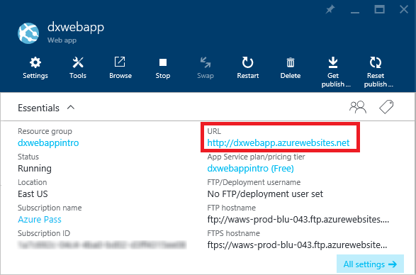

    _The Web site URL_ -->

1. Confirm that the placeholder page appears. Then close the browser window or tab in which it opened and return to the Azure Portal.

    <!-- 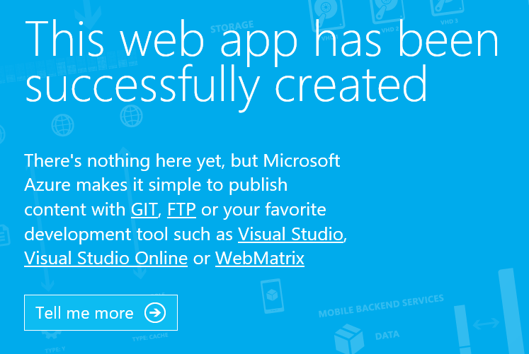

    _The Web site's temporary home page_ -->

1. Click **Application settings** in the "Settings" blade. (If the "Settings" blade isn't visible, you may have to scroll to the right to see it.)

    <!-- 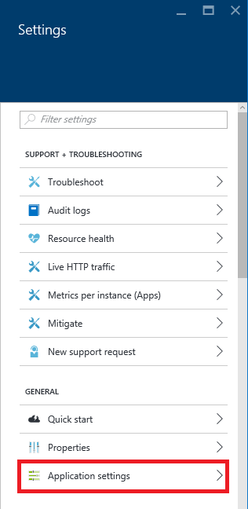

    _Viewing application settings_ -->

1. In the "Application settings" blade, scroll down to the "App settings" and "Connection strings" sections. These sections allow you to define key-value pairs that the app can access at runtime. Specifying values such as these in the portal rather than embedding them in your code makes it easier to run the app in different environments and in different contexts, and also helps mitigate the risk of inadvertently uploading code containing database connection strings and other sensitive items to public source-code repositories.

    > If you're curious about the **Slot setting** boxes, here's a quick explanation. In the Azure App Service, the _Basic_, _Standard_, and _Premium_ pricing tiers tiers allow you to provision multiple **deployment slots** for a given Web App. You can use these slots in several ways, including setting up pre-production staging environments for testing code changes before putting them into production. The **Slot setting** boxes allow you to specify whether a setting or connection string applies to all deployment slots or only to a particular deployment slot.

1. By default, connection strings are hidden for security reasons. If so, you need to Click **Show connection string values** to reveal them.

    <!-- 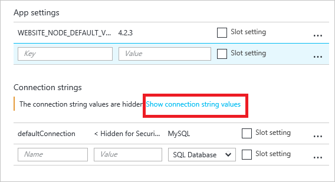

    _Showing connection string values_ -->


1. Scroll down further to the MySQL in App to view the connection string information. For the MySQL app we are building the connection string information is stored here rather than in the default location. Observe the value: "MYSQLCONNSTR_localdb".

Most platforms can access connection strings and app settings as environment variables. .NET applications can access them as if they were part of the application's web.config file. The PHP code that you added in [Exercise 1](#Exercise1) retrieves the default connection string by calling `getenv("MYSQLCONNSTR_localdb");` You can find additional information about the conventions used to access these variables [here](https://azure.microsoft.com/en-us/blog/windows-azure-web-sites-how-application-strings-and-connection-strings-work/).

<a name="Exercise3"></a>
## Exercise 3: Deploy the Web site

Now it is time to copy the files that comprise your Web site to the Azure Web App. In this exercise, you will publish your Web site using FTP.

1. Return to the Azure Portal and open the blade for the Web App if it isn't already open. (An easy way to open the blade is to click the tile that represents the app on your dashboard.) Then click **Settings** at the top of the blade to open a "Settings" blade.

    <!-- 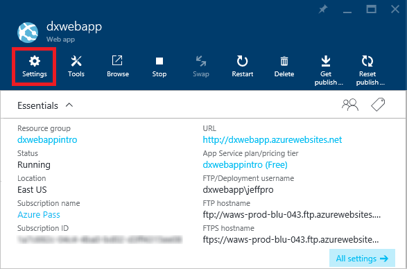

    _Opening the "Settings" blade_ -->

1. In the "Settings" blade, scroll down and click **Deployment credentials** to open the "Set deployment credentials" blade.

    <!-- 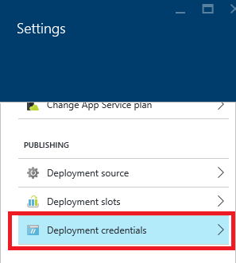

    _Opening the "Set deployment credentials" blade_ -->

1. Enter a user name and password for connecting to your site via FTP. **Be sure to remember the password**. Click the **Save** button at the top of the blade to save these credentials, and then close the "Set deployment credentials" blade.

    <!-- 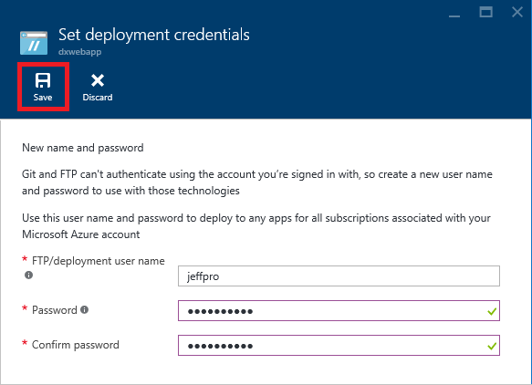

    _Specifying FTP credentials_ -->

1. Return to the blade for the Web App. Locate the **FTP/Deployment username** and **FTP hostname** values. Hover the mouse cursor over the FTP hostname, and click the **Copy** button that appears on the right to copy the hostname to the clipboard.

    <!-- 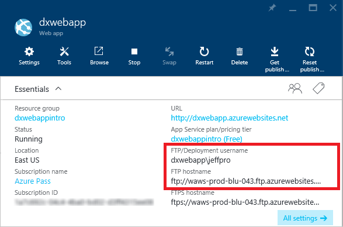

    _The FTP username and hostname_ -->

1. Open a Windows File Explorer window and paste the FTP hostname value into the address box at the top of the window. Then press **Enter**.

    <!-- 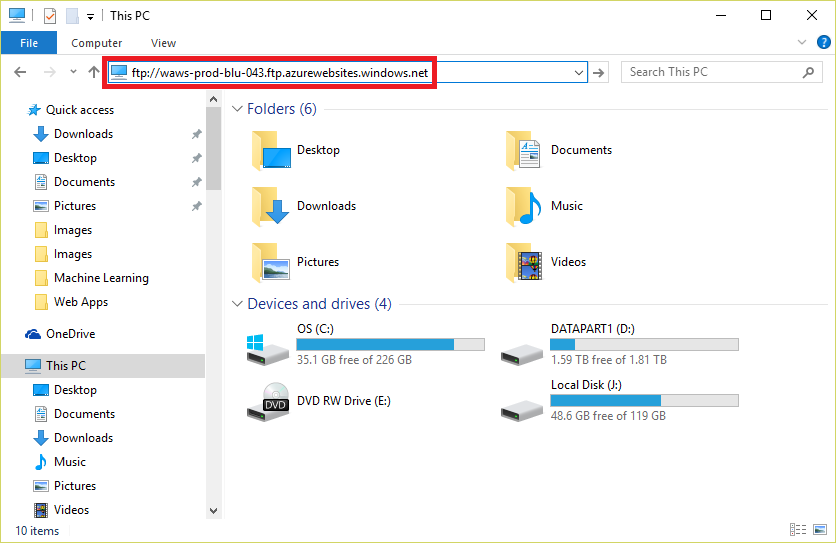

    _Entering the FTP hostname in File Explorer_ -->

1. When prompted to enter FTP credentials, enter the FTP username (the one labeled **FTP Deployment/username** in Step 4) and the password you specified in Step 3. Then click **Log On**.

    <!-- 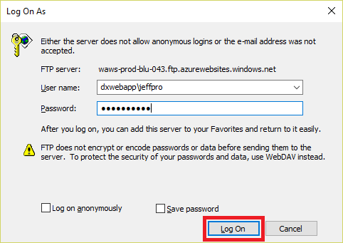

    _Entering your FTP credentials_ -->

1. Double-click the **site** folder in the File Explorer window.

    <!-- 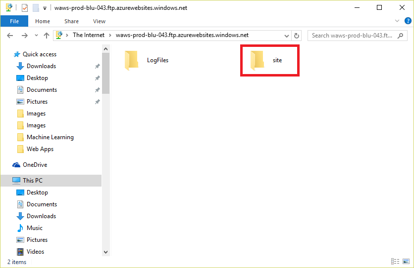

    _Opening the site folder_ -->

1. Double-click the **wwwroot** folder in the File Explorer window. This is the root folder for your Web site.

    <!-- 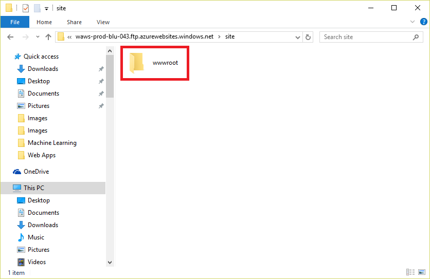

    _Opening the wwwroot folder_ -->

1. Delete the **hostingstart.html** file. This is the placeholder page you saw earlier when you connected to the site in your browser. When prompted to confirm the deletion, select **Yes**.

1. Open another File Explorer window and navigate to the folder containing the Web site files you created in [Exercise 1](#Exercise1).

1. Copy all of the files and folders that comprise the Web site to your site's **wwwroot** folder.  

    <!-- 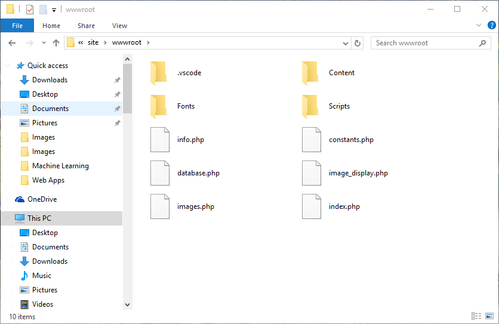

    _Copying the web site files_ -->

1. Congratulations! You now have a working Web site. Open your browser and navigate to the Web site URL, which is shown in the Web App's blade in the portal. Or simply click the URL in the portal.

    <!-- 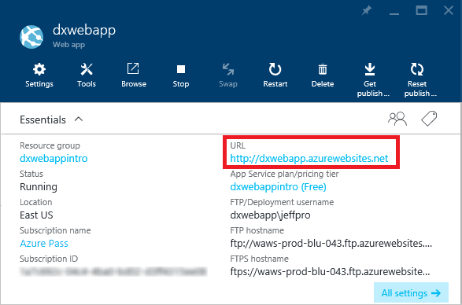

    _Navigating to the finished Web site_ -->

1. Upload a few images to the Web site. Click on any of the images to see enlarged views.

	> By default, the PHP installation in your Azure Web App limits file uploads to 2 MB. You can increase the limit by adding a .user.ini file to your site as [described here](https://blogs.msdn.microsoft.com/kaushal/2014/01/01/windows-azure-web-sites-file-upload-limit-for-php-sites-hosted-on-waws/). For now, just upload images that are smaller than 2 MB.

    <!-- 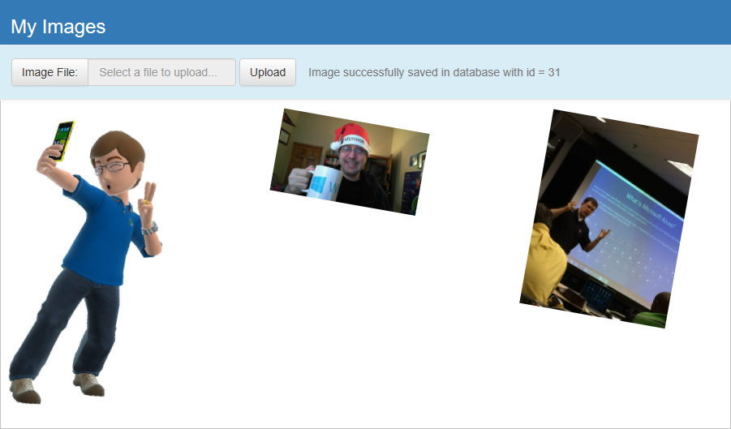

    _The working Web site_ -->

## Summary

In this hands-on lab, you learned how to:

- Use Visual Studio Code to build a Web site that uses PHP and MySQL
- Provision an Azure Web App
- Upload a Web site to Azure

Azure Web Apps allows you to use the tools and languages you already know to build great Web sites and publish them to the Web. You can focus on what you know and what you want to accomplish rather than spend time maintaining physical infrastructure, installing security updates, and learning new languages. Moreover, Azure Web Apps can easily leverage other features of the Azure ecosystem such as Azure Storage, Azure Search, and Azure Cognitive Services to achieve unprecedented scale and richness. Which, as it happens, is the subject of the next lab.

----

Copyright 2016 Microsoft Corporation. All rights reserved. Except where otherwise noted, these materials are licensed under the terms of the MIT License. You may use them according to the license as is most appropriate for your project. The terms of this license can be found at https://opensource.org/licenses/MIT.
